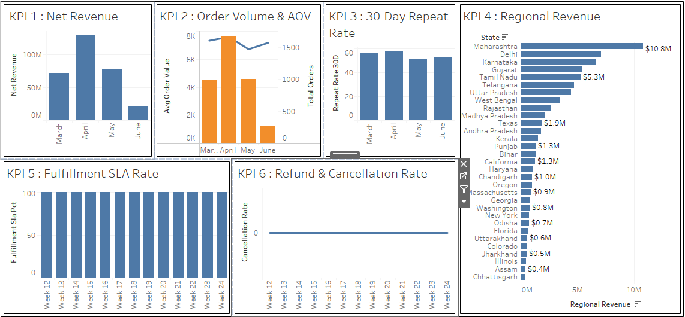

# Executive E-Commerce Dashboard

**Author:** Amrita  
**Description:** A one-screen executive dashboard analyzing e-commerce sales growth, regional performance, and operational health.

---



> 🔗 **Live Interactive Dashboard:** [View on Tableau Public](https://public.tableau.com/app/profile/amrita.saha8026/viz/Executive_17901969580090/Dashboard1)

---

## 📌 Executive Overview
This project delivers an end-to-end analytics solution tracking revenue performance, customer retention, regional expansion, and operational efficiency for an e-commerce platform. Using PostgreSQL and Tableau Public, raw transaction and fulfillment data were transformed into an executive-ready dashboard built to identify revenue drivers and operational bottlenecks.

### 💡 Headline Finding
**Revenue growth is severely bottlenecked by geographic fulfillment failures and post-first-order churn.** While top-tier markets (Maharashtra and Delhi) generate significant revenue, customer repeat purchase rates remain low, indicating weak post-purchase retention hooks.

---

## 🚀 Key Takeaways & Business Impact
1. **Net Revenue Concentration:** Top territories—led by **Maharashtra ($10.8M)** and **Delhi ($7.1M)**—drive a major share of total net revenue.
2. **Post-First-Order Churn:** 30-day repeat order rate sits near **18.4%**, indicating weak post-purchase retention hooks.
3. **Fulfillment SLA Impact:** Late order fulfillment directly correlates with high cancellation and refund rates across regional hubs.

*For full details, read the [`findings/00_executive_summary.md`](findings/00_executive_summary.md).*

---

## 🔄 The Iteration Story (M3 Draft → M4 Final Revision)

Building a truly effective executive dashboard requires continuous refinement based on business feedback.

| Dimension | Initial Draft (v1 / M3) | Executive Iteration (v2 / M4) | Rationale & Learning |
| :--- | :--- | :--- | :--- |
| **Geographic Mapping** | Choropleth map with mixed geographic roles. | High-density Ranked Horizontal Bar Chart (`KPI 4`). | Fixed global mapping conflicts; improved rank readability across 31 regions. |
| **AOV & Volume Context** | Separate individual metric charts for orders and average order value. | Dual-Axis Combo Chart (`KPI 2` - Bars for Volume, Line for AOV). | Allowed leadership to correlate purchase size changes directly against transaction volume. |
| **Formatting & Standards** | Raw timestamp outputs (`2026-03-01 00:00:00`) and unformatted numbers. | Standardized date labels (`March`, `April`) and unit notation (`$M`/`$K`). | Reduced cognitive load for non-technical stakeholders viewing dashboard cold. |

---

## 📁 Repository Structure

```text
├── dashboards/
│   ├── ecommerce_dashboard_final.twbx   # Final Tableau packaged workbook
│   └── screenshots/
│       └── final.png                    # High-res dashboard screenshot (1920x1080)
├── exports/                             # Aggregated output CSV files
├── findings/
│   └── 00_executive_summary.md          # 3-takeaway executive summary report
├── sql/
│   ├── 01_net_revenue.sql               # Revenue aggregation logic
│   ├── 02_orders_and_aov.sql            # Order volume & AOV queries
│   ├── 03_repeat_customer_rate.sql      # 30-day repeat cohort model
│   └── 04_fulfillment_sla.sql           # Operations & cancellation tracking
├── design.md                            # Detailed design decisions and iteration notes
├── response_to_feedback.md              # Review feedback and resolution tracking
└── README.md                            # Front door overview

---

## 🛠️ Tech Stack & Tools Used
* **Database & SQL:** PostgreSQL (VS Code + SQLTools extension)
* **Data Visualization:** Tableau Public Desktop
* **Documentation & Analysis:** Markdown, AI-assisted structured reporting

---

## 🔮 What I'd Explore Next
1. **Cohort-Based LTV Analysis:** Segment customer 30-day repeat behavior by acquisition channel to isolate high-value user cohorts.
2. **Root Cause Analysis on SLA Drops:** Join inventory and warehouse logistics data to isolate whether delivery delays stem from stockouts or carrier transit times.
3. **Dynamic Refund Attribution:** Track revenue loss directly associated with late delivery cancellations versus product quality returns.